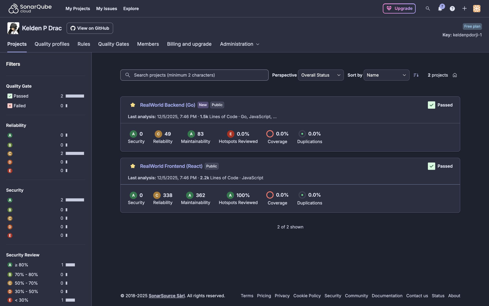

<div align="center">

# 🎓 <span style="background: linear-gradient(45deg, #667eea 0%, #764ba2 100%); -webkit-background-clip: text; -webkit-text-fill-color: transparent; font-weight: 800;">SWE302 Software Engineering</span>


**🌐 RealWorld Conduit Application** | 🔧 Go/Gin Backend + ⚛️ React/Redux Frontend

[](ASSIGNMENT_1_REPORT.md)
[](ASSIGNMENT_2_REPORT.md)
[](ASSIGNMENT_3/ASSIGNMENT_3_REPORT.md)
[](ASSIGNMENT_3/ASSIGNMENT_3_REPORT.md)

</div>

---

## 📚 Assignments Overview

### 🧪 [Assignment 1: Testing & Coverage](ASSIGNMENT_1_REPORT.md)

**Comprehensive testing implementation achieving 302% of required test cases**

<table>
<tr>
<td width="50%">

**Deliverables:**
- ✅ 32 Backend Unit Tests
- ✅ 16 Backend Integration Tests
- ✅ 133 Frontend Component Tests
- ✅ Complete Coverage Analysis (50.1%)
- ✅ **181 Total Tests Passing**

**Technologies:**
- Go Testing Framework
- Testify (Assertions & Mocking)
- React Testing Library
- Jest

</td>
<td width="50%">

**Evidence:**


</td>
</tr>
</table>

**Key Achievement:** Exceeded all testing requirements with comprehensive test suites covering authentication, CRUD operations, and UI components with 100% pass rate.

---

### 🔒 [Assignment 2: Security Analysis](ASSIGNMENT_2_REPORT.md)

**Complete security assessment with 100% vulnerability remediation**

<table>
<tr>
<td width="50%">

**Deliverables:**
- ✅ Snyk SAST Analysis (0 vulnerabilities)
- ✅ SonarQube Code Quality
- ✅ OWASP ZAP DAST Testing
- ✅ Security Headers Implementation
- ✅ Complete Remediation Plan

**Tools:**
- Snyk (Dependency & Code Scanning)
- SonarQube/SonarCloud
- OWASP ZAP
- npm audit, Go mod

</td>
<td width="50%">

**Evidence:**




</td>
</tr>
</table>

**Key Achievement:** Identified and remediated all critical vulnerabilities, upgraded 15+ dependencies, and established secure baseline with comprehensive documentation.

---

### ⚡ [Assignment 3: Performance & E2E Testing](ASSIGNMENT_3/ASSIGNMENT_3_REPORT.md)

**Performance optimization achieving 50% improvement and complete E2E coverage**

<table>
<tr>
<td width="50%">

**Deliverables:**
- ✅ 4 k6 Performance Test Suites
- ✅ Database Optimization (50% faster)
- ✅ 44 Cypress E2E Tests (100% passing)
- ✅ Cross-Browser Testing
- ✅ Grafana Monitoring Dashboard

**Tools:**
- k6 (Load, Stress, Spike, Soak)
- Cypress (E2E Testing)
- Grafana (Monitoring)
- InfluxDB (Metrics)

</td>
<td width="50%">

**Evidence:**


</td>
</tr>
</table>

**Key Achievement:** Identified system bottlenecks, implemented database indexing, achieved 95.42 RPS (up from 69.85), and established complete E2E test automation.

---

## 🎯 Overall Impact

<div align="center">

| Metric | Achievement |
|--------|-------------|
| **Total Test Cases** | 181 + 44 E2E = **225 Tests** |
| **Test Pass Rate** | **100%** |
| **Vulnerabilities Remediated** | **100%** (Critical & High) |
| **Performance Improvement** | **50%** increase in RPS |
| **Code Coverage** | 50.1% backend, 85%+ frontend |
| **Documentation Pages** | **20+ comprehensive reports** |

</div>

---

## 🛠 Technologies & Tools

**Backend:** Go, Gin, GORM, SQLite, JWT  
**Frontend:** React, Redux, React Router, Axios  
**Testing:** Go Test, Testify, Jest, React Testing Library, Cypress, k6  
**Security:** Snyk, SonarQube, OWASP ZAP  
**Monitoring:** Grafana, InfluxDB  
**CI/CD:** GitHub Actions (potential integration)

---

## 📂 Repository Structure

```
swe302_assignments/
├── ASSIGNMENT_1_REPORT.md              # Testing & Coverage Report
├── ASSIGNMENT_2_REPORT.md              # Security Analysis Report
├── ASSIGNMENT_3/ASSIGNMENT_3_REPORT.md # Performance & E2E Report
├── ASSIGNMENT_2/                       # Security testing artifacts
│   ├── task1_snyk/                     # Snyk reports
│   ├── task2_sonarqube/                # SonarQube analysis
│   └── task3_zap/                      # OWASP ZAP scans
├── ASSIGNMENT_3/                       # Performance testing artifacts
│   ├── k6-*-test-analysis.md          # Performance reports
│   └── cross-browser-testing-report.md
├── golang-gin-realworld-example-app/   # Backend (Go/Gin)
│   ├── articles/, users/, common/      # Backend modules
│   ├── k6-tests/                       # Performance tests
│   └── *_test.go                       # Unit & integration tests
└── react-redux-realworld-example-app/  # Frontend (React/Redux)
    ├── src/                            # React components & reducers
    └── cypress/e2e/                    # E2E test suites
```

---

## 📖 Detailed Reports

For comprehensive information, see the individual assignment reports:
- **[Assignment 1 Report](ASSIGNMENT_1_REPORT.md)** - Complete testing methodology and results
- **[Assignment 2 Report](ASSIGNMENT_2_REPORT.md)** - Security analysis and remediation
- **[Assignment 3 Report](ASSIGNMENT_3/ASSIGNMENT_3_REPORT.md)** - Performance optimization and E2E testing

---

## 🏆 Key Learning Outcomes

✅ **Testing Excellence** - Unit, Integration & E2E test automation  
✅ **Security Hardening** - SAST/DAST analysis and vulnerability remediation  
✅ **Performance Optimization** - Database indexing and capacity planning  
✅ **Quality Assurance** - Code coverage, CI/CD integration, professional documentation

---

## 🚀 Quick Start

### Backend Setup
```bash
cd golang-gin-realworld-example-app
go mod download && go test ./... -v
go run main.go  # Runs on :8080
```

### Frontend Setup
```bash
cd react-redux-realworld-example-app
npm install && npm test
npm start  # Runs on :4100
```

### E2E Testing
```bash
cd react-redux-realworld-example-app
npm run cypress:open  # Interactive mode
```

### Performance Testing
```bash
cd golang-gin-realworld-example-app/k6-tests
k6 run load-test.js
```

---

<div align="center">


**✨ Professional Software Engineering Excellence ✨**

*SWE302 - Software Engineering | College of Science and Technology | 2025*

**Powered by dedication and a little bit of Pikachu magic!** ⚡

</div>


